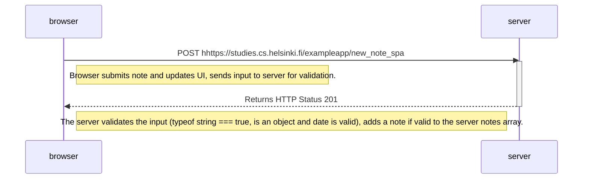

```mermaid
sequenceDiagram
    participant browser
    participant server

    browser->>server: POST hhttps://studies.cs.helsinki.fi/exampleapp/new_note_spa
    activate server
    Note right of browser: Browser submits note and updates UI, sends input to server for validation.

    server-->>browser: Returns HTTP Status 201
    deactivate server
    Note right of browser: The server validates the input (typeof string === true, is an object and date is valid), adds a note if valid to the server notes array.
```
